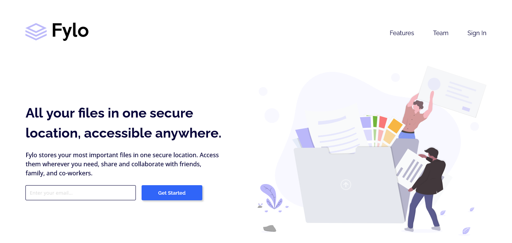

# Frontend Mentor - Fylo landing page with two column layout solution

This is a solution to the [Fylo landing page with two column layout challenge on Frontend Mentor](https://www.frontendmentor.io/challenges/fylo-landing-page-with-two-column-layout-5ca5ef041e82137ec91a50f5). Frontend Mentor challenges help you improve your coding skills by building realistic projects.

## Table of contents

- [overview](#overview)
  - [The challenge](#the-challenge)
  - [Screenshot](#screenshot)
  - [Links](#links)
- [My process](#my-process)
  - [Built with](#built-with)
  - [Useful resources](#useful-resources)
- [Author](#author)

## overview

A frontend two column layout challenge.

### The challenge

Users should be able to:

- View the optimal layout for the site depending on their device's screen size
- See hover states for all interactive elements on the page

### Screenshot

### Links

- Live Site URL: [Add live site URL here](https://your-live-site-url.com) - you can checkout the actual design in the design folder to see how close I got to it.

## My process

### Built with

- Semantic HTML5 markup
- CSS custom properties
- CSS custom transitions and animations
- Flexbox
- Vanilla JavaScript

### Useful resources

- [MDN web docs](https://developer.mozilla.org/en-US/) - very useful resource

## Author

- Frontend Mentor - [@1CoderNifemi](https://www.frontendmentor.io/profile/1CoderNifemi)
